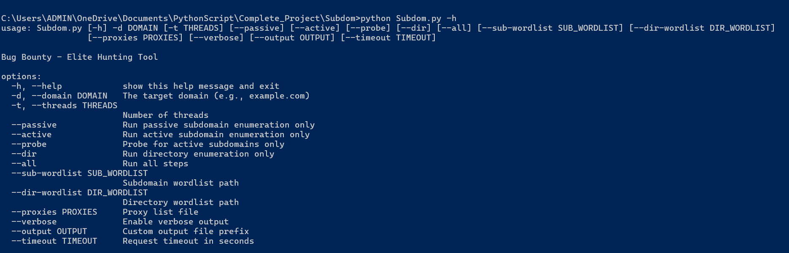
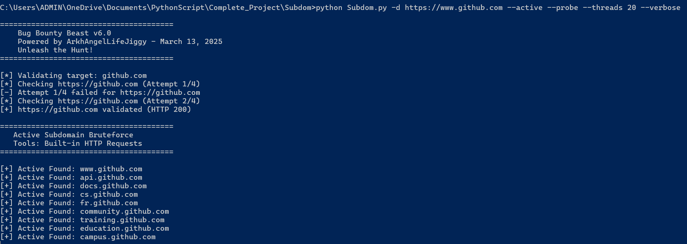

# Bug Bounty Beast

A powerful and flexible tool for subdomain and directory enumeration, designed for bug bounty hunting and web application reconnaissance. This script automates the discovery of potential attack vectors through passive and active scanning techniques.


---

## Features

- **Multi-Source Subdomain Enumeration:** Gathers subdomains from various sources:
  - **Passive DNS:** Queries `crt.sh` and the Wayback Machine.
  - **DNS Bruteforce:** Actively resolves subdomains using a provided wordlist.
- **Active Subdomain Probing:** Validates discovered subdomains to identify live hosts (HTTP 200).
- **Directory Bruteforcing:** Scans active subdomains for common and hidden directories.
- **Advanced WAF Evasion:** Implements sophisticated techniques to bypass Web Application Firewalls:
  - Randomized User-Agents and HTTP headers.
  - Resilient proxy rotation to avoid IP blocking.
- **Fully Configurable:** Control the enumeration process with command-line arguments for threads, wordlists, and scan types.
- **Robust and Resilient:** Handles errors gracefully and retries failed requests to ensure comprehensive results.
- **Organized Output:** Saves results in structured text files for easy analysis.

---

## Setup & Installation

1.  **Clone the repository or download the script.**
2.  cd SubDom

3.  **Create the `requirements.txt` file** in the same directory as the script:

    ```txt
    requests
    beautifulsoup4
    dnspython
    ```

4.  **Install the required Python libraries** using pip:

    ```bash
    pip install -r requirements.txt
    ```

5.  **(Optional) Create Wordlist and Proxy Files:**
    - The script will automatically download default wordlists on the first run.
    - To use your own, create `subdomains.txt`, `directories.txt`, and `proxies.txt` in the project directory, or specify their paths using command-line arguments.

---

## Usage

The script offers a variety of flags to customize your scans.

### Basic Examples
**For Helper:**

  ```bash
  python Subdom.py -h
  ```

- **Run all enumeration steps on a target:**

  ```bash
  python Subdom.py -d hhtps://www.github.com --all --verbose
  ```

**Run only active subdomain enumeration:**

  ```bash
  python Subdom.py -d https://www.github.com --active--threads 5 --verbose
  ```

- **Run only passive subdomain enumeration:**

  ```bash
  python Subdom.py -d https://www.github.com --passive --threads 5 --verbose
  ```

- **Run directory enumeration on previously discovered active subdomains:**

  ```bash
  python Subdom.py -d https://www.github.com --dir --dir-wordlist /path/to/my/dirs.txt
  ```

### Command-Line Arguments

| Argument         | Description                                                    |
| ---------------- | -------------------------------------------------------------- |
| `-t`, `--target` | **(Required)** The target domain or URL (e.g., `example.com`). |
| `--passive`      | Run passive subdomain enumeration only.                        |
| `--active`       | Run active (bruteforce) subdomain enumeration only.            |
| `--probe`        | Probe for active (HTTP 200) subdomains only.                   |
| `--dir`          | Run directory enumeration only.                                |
| `--all`          | Run all enumeration steps (default if no other mode is set).   |
| `--sub-wordlist` | Path to a custom subdomain wordlist.                           |
| `--dir-wordlist` | Path to a custom directory wordlist.                           |
| `--proxies`      | Path to a file containing a list of proxies.                   |
| `--verbose`      | Enable verbose output to see the script's progress.            |
| `--output`       | Custom prefix for output files.                                |
| `--threads`      | Number of concurrent threads to use (default: 10).             |
| `--timeout`      | Request timeout in seconds (default: 5).                       |

---




